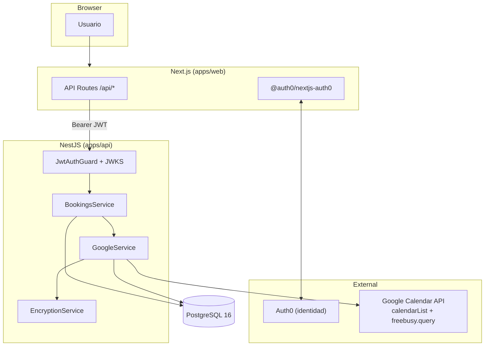

# Booking System

Full-stack monorepo for a scheduling system that validates booking conflicts against Google Calendar.

## Stack

| Layer    | Technology                          |
| -------- | ----------------------------------- |
| Monorepo | npm workspaces + Turborepo          |
| API      | NestJS, Prisma, PostgreSQL 16       |
| Web      | Next.js 15 (App Router), Tailwind CSS |
| Shared   | `@booking/shared-types` workspace package |

## Repository structure

```
.
├── apps/
│   ├── api/                 # NestJS REST API
│   │   ├── prisma/          # Schema and migrations
│   │   └── src/
│   └── web/                 # Next.js frontend
├── packages/
│   └── shared-types/        # Shared TypeScript interfaces/DTOs
├── .github/workflows/       # CI pipelines
├── docker-compose.yml
├── docker-compose.prod.yml
└── turbo.json
```

## Prerequisites

- [Docker](https://docs.docker.com/get-docker/) and Docker Compose v2
- [Node.js](https://nodejs.org/) 20+ (for local development without Docker)

## Quick start with Docker

1. Copy the environment template and adjust values if needed:

   ```bash
   cp .env.example .env
   ```

2. Build and start all services (PostgreSQL, API, Web):

   ```bash
   docker compose up --build
   ```

3. Open the apps:

   - **Web:** http://localhost:3000 (or the `WEB_PORT` value from `.env`)
   - **API:** http://localhost:3001

> **Note:** If ports `5432` or `3000` are already in use on your machine, adjust `DATABASE_URL` (host port `5433` is mapped in `docker-compose.yml`) and `WEB_PORT` in `.env` before running `docker compose up`.

The API container runs `prisma migrate deploy` automatically on startup before launching the NestJS server.

## Database migrations

### With Docker (automatic)

Migrations are applied by the API entrypoint on every container start via `prisma migrate deploy`.

### Local development

1. Start PostgreSQL (or run only the database service):

   ```bash
   docker compose up postgres -d
   ```

2. From the repo root, install dependencies:

   ```bash
   npm install
   ```

3. Apply migrations:

   ```bash
   npm run prisma:migrate:deploy --workspace=api
   ```

   Or create a new migration during development:

   ```bash
   npm run prisma:migrate:dev --workspace=api
   ```

## Local development (without Docker for apps)

```bash
cp .env.example .env
npm install
docker compose up postgres -d
npm run prisma:migrate:deploy --workspace=api
npm run dev
```

This starts both `api` and `web` in watch mode via Turborepo.

## Scripts

| Command              | Description                              |
| -------------------- | ---------------------------------------- |
| `npm run dev`        | Start all apps in development mode       |
| `npm run build`      | Build all apps and packages              |
| `npm run lint`       | Lint all workspaces                      |
| `npm run typecheck`  | Type-check all workspaces                |
| `npm run test`       | Run all tests (API unit + integration, Web E2E) |
| `npm run format`     | Format code with Prettier                |

### API tests (`apps/api`)

| Command | Description |
| ------- | ----------- |
| `npm run test --workspace=api` | Unit tests (Jest) |
| `npm run test:cov --workspace=api` | Unit tests with coverage report |
| `npm run test:integration --workspace=api` | Integration tests (Postgres via Testcontainers or `TEST_DATABASE_URL`) |
| `npm run test:e2e --workspace=api` | API smoke E2E (health check) |

### Web tests (`apps/web`)

| Command | Description |
| ------- | ----------- |
| `npm run test:e2e:install --workspace=web` | Install Playwright Chromium |
| `npm run test:e2e --workspace=web` | Playwright E2E (requires `npm run build --workspace=web` first) |

Integration tests use **Testcontainers** locally (Docker required). In CI, Postgres runs as a **GitHub Actions service** and tests connect via `TEST_DATABASE_URL`.

E2E tests set `E2E_TEST_MODE=true` to bypass Auth0 session checks and mock API routes at the BFF layer.

## Architecture overview



### OAuth flows (two separate concerns)

```
Auth0 login (app identity)          Google Calendar OAuth (calendar access)
─────────────────────────          ─────────────────────────────────────
User → Auth0 → JWT in httpOnly       User → GET /google/connect → Google consent
cookie via Next.js SDK               → callback → encrypted tokens in DB
```

## Production deployment (Docker)

For production, use `docker-compose.prod.yml` — Postgres is **not** exposed to the host:

```bash
cp .env.example .env
# Fill all required values (see Environment variables below)

docker compose -f docker-compose.prod.yml up --build -d
```

The API entrypoint always runs `prisma migrate deploy` (never `migrate dev`) before starting.

For local development with host-accessible Postgres (port 5433), use the default `docker-compose.yml`.

## Environment variables

All variables are documented in [`.env.example`](./.env.example). Summary:

| Variable | Used by | Description |
| -------- | ------- | ----------- |
| `DATABASE_URL` | API | PostgreSQL connection string |
| `POSTGRES_DB`, `POSTGRES_USER`, `POSTGRES_PASSWORD` | Docker | Postgres container credentials |
| `PORT` | API | API listen port (default `3001`) |
| `WEB_PORT` | Docker | Host port for web container (default `3000`) |
| `NODE_ENV` | API, Web | `development` \| `production` \| `test` |
| `APP_BASE_URL` | API, Web | Public frontend URL (CORS, OAuth redirects) |
| `NEXT_PUBLIC_API_URL` | Web | API URL exposed to the browser |
| `API_URL` | Web | Server-side API URL (Docker: `http://api:3001`) |
| `AUTH0_DOMAIN` | API, Web | Auth0 tenant domain |
| `AUTH0_AUDIENCE` | API, Web | Auth0 API identifier |
| `AUTH0_CLIENT_ID` | Web | Auth0 application client ID |
| `AUTH0_CLIENT_SECRET` | Web | Auth0 client secret (server-only) |
| `AUTH0_SECRET` | Web | Cookie encryption secret (`openssl rand -hex 32`) |
| `GOOGLE_CLIENT_ID` | API | Google OAuth client ID |
| `GOOGLE_CLIENT_SECRET` | API | Google OAuth client secret |
| `GOOGLE_REDIRECT_URI` | API | Must match Google Cloud Console redirect URI |
| `ENCRYPTION_KEY` | API | 64 hex chars — encrypts Google tokens at rest |
| `TEST_DATABASE_URL` | API tests | Postgres for integration tests (set in CI) |
| `E2E_TEST_MODE` | Web tests | Bypass Auth0 in Playwright (never in production) |

## Architecture decisions

### Monorepo tooling: Turborepo + npm workspaces

We use **npm workspaces** for dependency linking (e.g. `@booking/shared-types` is consumed by both apps without a separate publish step) and **Turborepo** on top to orchestrate `lint`, `build`, `test`, and `typecheck` with caching and parallel execution. Turborepo adds minimal configuration (`turbo.json`) while making CI and local dev scripts consistent across packages. For a two-app monorepo, workspaces alone would work, but Turborepo pays off immediately in the GitHub Actions pipeline and as the project grows.

### Database: PostgreSQL 16 with Prisma

**PostgreSQL** provides reliable ACID transactions, strong constraint support, and efficient range queries — important for detecting overlapping bookings. **Prisma** gives type-safe database access, declarative schema migrations, and a generated client that integrates cleanly with NestJS. The schema includes `User`, `Booking`, `BookingIdempotency`, and `GoogleToken` (encrypted OAuth credentials for Calendar access).

### Authentication: Auth0 for application identity only

**Auth0** handles user login (Google as the identity provider inside Auth0) and issues JWT access tokens for our API. The session lives in **httpOnly cookies** managed by `@auth0/nextjs-auth0` on the Next.js app — tokens are never stored in `localStorage` or client-side React state.

**Auth0 is not used for Google Calendar API access.** Calendar OAuth (refresh tokens, scopes, etc.) is a separate, explicit OAuth2 flow via `googleapis`. Treat Auth0 purely as the application session / identity provider.

The NestJS API validates Auth0 JWTs with `passport-jwt` + `jwks-rsa` (signature via JWKS, `aud` and `iss` checks). On first authenticated request, the API upserts a `User` row keyed by `auth0Id`.

### Auth0 setup (Dashboard)

1. **Create a Regular Web Application** in [Auth0 Dashboard](https://manage.auth0.com) → Applications → Create Application → Regular Web Applications.

2. **Application settings** (replace port if you changed `WEB_PORT` / `APP_BASE_URL`):

   | Setting | Value |
   | ------- | ----- |
   | Allowed Callback URLs | `http://localhost:3000/auth/callback` |
   | Allowed Logout URLs | `http://localhost:3000` |
   | Allowed Web Origins | `http://localhost:3000` |

   Copy **Domain**, **Client ID**, and **Client Secret** into `.env`.

3. **Enable Google social login**: Authentication → Social → Google (use your Google OAuth credentials or Auth0 dev keys for testing).

4. **Create an API** (Applications → APIs → Create API):
   - **Name:** Booking System API (or any name)
   - **Identifier:** e.g. `https://booking-api` — this is your `AUTH0_AUDIENCE`
   - **Signing Algorithm:** RS256

5. **Add custom claims to the access token** (optional but recommended so `email` and `name` reach the API): Actions → Library → Build Custom → *Login / Post Login*:

   ```javascript
   exports.onExecutePostLogin = async (event, api) => {
     const namespace = 'https://booking.app';
     if (event.authorization) {
       api.accessToken.setCustomClaim(`${namespace}/email`, event.user.email);
       api.accessToken.setCustomClaim(`${namespace}/name`, event.user.name);
     }
   };
   ```

   Deploy the action and add it to the Login flow.

6. **Generate `AUTH0_SECRET`** for cookie encryption:

   ```bash
   openssl rand -hex 32
   ```

7. Fill `.env` from `.env.example`: `AUTH0_DOMAIN`, `AUTH0_CLIENT_ID`, `AUTH0_CLIENT_SECRET`, `AUTH0_AUDIENCE`, `AUTH0_SECRET`, `APP_BASE_URL`.

### Auth flow (end-to-end)

1. User clicks **Iniciar sesión con Google** → `/auth/login?connection=google-oauth2`
2. Auth0 completes OAuth; SDK stores session in httpOnly cookies
3. Dashboard server component calls `GET /api/v1/users/me` with `Authorization: Bearer <access_token>`
4. API validates JWT, upserts `User`, returns profile
5. Expired/invalid JWT → API returns `401` → frontend redirects to login

### Booking conflict detection: application check + PostgreSQL exclusion constraint

Overlapping bookings for the same user are prevented at two layers:

1. **Application layer** — Before inserting, `BookingsService` queries for existing `CONFIRMED` bookings whose time range overlaps the requested slot (`startTime < new.endTime AND endTime > new.startTime`). Adjacent slots (where one ends exactly when the other starts) are allowed.

2. **Database layer (defense in depth)** — A PostgreSQL `EXCLUDE USING gist` constraint on `Booking` prevents two `CONFIRMED` rows for the same `userId` from having overlapping `tsrange(startTime, endTime, '[)')` values. This closes the race-condition window where two concurrent requests both pass the application check before either INSERT completes.

Prisma cannot express this constraint declaratively, so it lives in a manual SQL migration (`btree_gist` extension + `Booking_no_overlap_confirmed`). When the constraint fires, Postgres returns SQLSTATE `23P01`, which the service maps to a `409 Conflict` with a user-facing message distinct from the in-code overlap check.

3. **Google Calendar (optional)** — If the user has connected Google Calendar, `BookingsService` calls `GoogleService.hasConflict()` via the `CalendarConflictChecker` interface **after** the internal check and **before** INSERT. A busy block on any of the user's **selected** Google calendars returns `409` with a message that explicitly mentions Google Calendar. Users without a connected calendar skip this step entirely.

**Idempotency** — Optional `Idempotency-Key` header on `POST /bookings` is stored in a `BookingIdempotency` table (unique per `userId` + key). Replays within 10 minutes return the original response without creating a duplicate booking.

### Google Calendar integration

Google Calendar is connected through a **separate OAuth2 flow** from Auth0 login. The user must already be authenticated (Auth0 JWT) and then explicitly choose **Conectar Google Calendar** on the dashboard. Logging in with Auth0 does **not** connect Google Calendar automatically.

#### What this integration does (and does not do)

| Behavior | Supported? |
| -------- | ---------- |
| Read busy/free blocks from Google Calendar to block conflicting bookings | Yes |
| Show Google busy times in the availability grid (amber slots) | Yes |
| Query all calendars **selected** in the Google Calendar sidebar | Yes |
| Create or update events in Google Calendar when you make a booking | **No** — reservations live only in this app's database |
| Read event titles, attendees, or descriptions from Google | **No** — only busy intervals via `freebusy.query` |
| Real-time sync when Google events change | **No** — busy times are fetched on demand (see CHANGELOG for planned webhooks) |

#### Google Cloud Console setup

1. Create or select a project in [Google Cloud Console](https://console.cloud.google.com/).
2. **Enable the Google Calendar API** (critical): APIs & Services → Library → search **Google Calendar API** → **Enable**.
   - OAuth consent alone is **not** enough. If the API is disabled, the app can show "connected" but return no events. The dashboard will surface a `syncError` explaining this.
   - Wait 2–5 minutes after enabling before testing.
3. Configure the **OAuth consent screen** (External or Internal; add test users if External and the app is in Testing mode).
4. Create **OAuth 2.0 credentials** → Application type: **Web application**:
   - **Authorized redirect URIs:** `http://localhost:3001/api/v1/google/callback` (adjust host/port for production; must match `GOOGLE_REDIRECT_URI` in `.env` exactly).
5. Copy **Client ID** and **Client secret** into `.env` as `GOOGLE_CLIENT_ID` and `GOOGLE_CLIENT_SECRET`.
   - The same Google Cloud **project** must have the Calendar API enabled. A mismatch between credentials and project is a common source of errors.
6. Generate `ENCRYPTION_KEY` for token encryption at rest:

   ```bash
   openssl rand -hex 32
   ```

   If you change `ENCRYPTION_KEY` after tokens were stored, disconnect and reconnect Google Calendar — old tokens cannot be decrypted.

#### OAuth scope choice

We request two read-only scopes:

- `calendar.freebusy` — query [`calendar.freebusy.query`](https://developers.google.com/calendar/api/v3/reference/freebusy/query) for busy/free blocks without reading event titles or descriptions.
- `calendar.calendarlist.readonly` — list the user's subscribed calendars so freebusy covers **all calendars selected in Google Calendar**, not only `primary`.

Conflict checks use **`freebusy.query`**, not `events.list`, because freebusy resolves recurring events into concrete busy intervals server-side.

If you connected Google Calendar before multi-calendar support was added, **disconnect and reconnect** once so Google grants the new scope.

#### API endpoints

| Method | Route | Auth | Description |
| ------ | ----- | ---- | ----------- |
| `GET` | `/api/v1/google/connect` | JWT | Returns Google OAuth authorization URL |
| `GET` | `/api/v1/google/callback` | — | OAuth redirect; exchanges code, stores encrypted tokens, redirects to frontend success page |
| `GET` | `/api/v1/google/status` | JWT | Returns `{ connected, isValid, syncHealthy, syncError? }` — probes Google Calendar when connected |
| `DELETE` | `/api/v1/google/disconnect` | JWT | Revokes token with Google and deletes `GoogleToken` row |
| `GET` | `/api/v1/bookings/availability` | JWT | Day availability: internal bookings + Google busy blocks. Query: `date` (YYYY-MM-DD), optional `timeZone` (IANA). Returns `googleCalendarConnected`, `googleCalendarSyncError?`, `occupiedSlots[]` |

OAuth tokens (`accessToken`, `refreshToken`) are encrypted with **AES-256-GCM** before persistence (`ENCRYPTION_KEY`). The encryption service is the only layer that ever sees plaintext tokens.

#### Availability in the UI

- **Dashboard** — Google Calendar card shows connection state. If OAuth succeeded but Google API calls fail, you see *"Conectado, pero no se pueden leer tus eventos"* with `syncError` details.
- **Bookings page / new booking form** — 30-minute slots from **07:00 to 21:00** in the user's local timezone:
  - Green — available
  - Red — internal booking
  - Amber — busy on Google Calendar
  - Orange — both
- Events outside the 07:00–21:00 grid are still considered for conflict checks when creating a booking, but they are not shown in the grid.

#### Resilience: degrade on Google API failure

If Google Calendar is unreachable (API disabled, 429, 503, timeouts) after exponential-backoff retries, or if the user's refresh token was revoked (`invalid_grant`), **`hasConflict` returns `false`** and the booking proceeds based on internal checks only. A **WARNING** is logged server-side. This is an explicit product decision: Google Calendar is an enhancement, not a hard dependency — we never return `500` or block booking creation solely because Google failed.

The UI still surfaces sync problems via `syncError` on `GET /google/status` and `googleCalendarSyncError` on `GET /bookings/availability` so users are not left thinking Google is working when it is not.

Revoked tokens are marked `isValid: false` so the dashboard can prompt the user to reconnect.

#### Connect flow (end-to-end)

1. Authenticated user clicks **Conectar Google Calendar** on the dashboard
2. Frontend calls `GET /api/v1/google/connect` → receives `{ url }` → redirects to Google
3. User grants consent (`access_type=offline`, `prompt=consent` to obtain refresh token)
4. Google redirects to `GET /api/v1/google/callback?code=…&state=…`
5. API exchanges code, encrypts tokens, upserts `GoogleToken`, redirects to `/dashboard/google-connected`
6. `GET /google/status` probes Google; `GET /bookings/availability` and `POST /bookings` call `calendarList.list` + `freebusy.query` on all **selected** calendars

#### Troubleshooting Google Calendar

| Symptom | Likely cause | Fix |
| ------- | ------------ | --- |
| Dashboard says connected but no Google events in the grid | **Google Calendar API not enabled** in the Cloud project tied to `GOOGLE_CLIENT_ID` | Enable the API in Cloud Console, wait a few minutes, disconnect + reconnect |
| `syncError` mentions insufficient scopes | Token issued before scope update | Disconnect and reconnect Google Calendar |
| Connected, then stopped working after `.env` change | `ENCRYPTION_KEY` changed — stored tokens cannot be decrypted | Restore the key or disconnect + reconnect |
| Some Google events ignored | Calendar unchecked in Google Calendar sidebar | Enable that calendar in Google Calendar (must be `selected`) |
| Event exists but slot stays green | Event marked **Free** (not busy) in Google | Change transparency to **Busy** in Google Calendar |
| OAuth works locally but not in Docker | `GOOGLE_REDIRECT_URI` or `APP_BASE_URL` mismatch | Ensure redirect URI in Cloud Console matches API URL; rebuild containers after `.env` changes |
| Still stuck | Server-side details | `docker compose logs api` — look for `GoogleService` warnings |

**Checklist after setup:** Calendar API enabled → correct redirect URI → connect from dashboard → status shows `syncHealthy: true` → pick a date with known events → amber slots appear.

## Security

Hardening measures applied before production testing and deploy:

| Area | Measure |
| ---- | ------- |
| Rate limiting | `@nestjs/throttler` globally (100 req/min/IP); **10 req/min** on `POST /bookings`, `GET /google/connect`, and `GET /google/callback` |
| CORS | Exact frontend origin from `APP_BASE_URL` only; `credentials: false` (browser uses same-origin Next.js API routes) |
| HTTP headers | **Helmet** for standard security headers |
| Input validation | Global `ValidationPipe` with `whitelist` + `forbidNonWhitelisted` on all DTOs |
| Errors | Global exception filter: generic `5xx` messages in production; details logged server-side |
| Health | `GET /api/v1/health` (no auth) checks PostgreSQL connectivity — used by Docker healthcheck |
| Secrets | Env-only configuration; `.env` gitignored; Google OAuth tokens encrypted at rest |
| Auth0 session | httpOnly cookies via `@auth0/nextjs-auth0`; JWT never in DOM, query params, or client `console` |
| XSS | User content (e.g. booking titles) rendered via React text nodes only — no `dangerouslySetInnerHTML` |

See [SECURITY.md](./SECURITY.md) for reporting vulnerabilities and operational guidance.

## Future improvements

See [CHANGELOG.md](./CHANGELOG.md) for planned enhancements (Google webhooks, writing bookings back to Google Calendar, email notifications, etc.).
